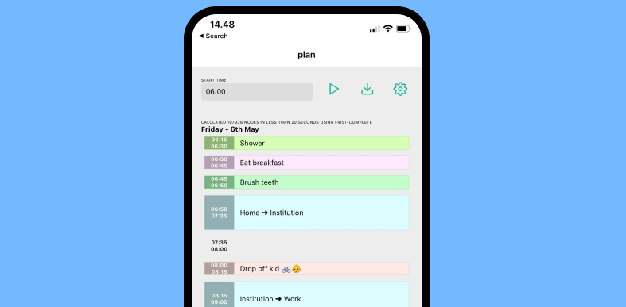
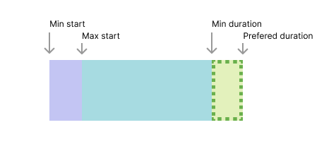
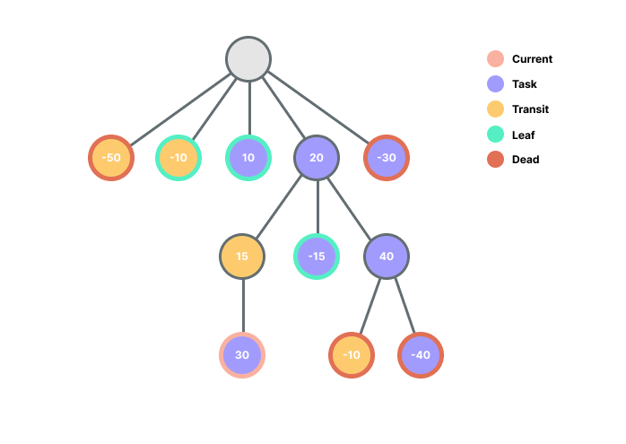

Allow me to introduce Bob. Bob is an algorithm, and he has just accepted a role as my assistant.

I am not very good when it comes to planning my day, and the many apps out there that promise to help haven't solved the problem for me, usually due to three significant shortcomings:

1. Most day planner apps do what their paper counterparts would do: record the plan you create. I don't want to make the plan; someone should do that for me.
2. They help you create a plan at the start of the day that you have to follow throughout the day. My days aren't that static, so my schedule needs to change throughout the day.
3. They can't handle transits between locations very well.

So to solve those issues, I decided that the piece of silicon in my pocket, capable of doing a million calculations a second, should be able to help me do something other than waste time doom scrolling. It should let me get more done throughout the day and help me get more time for stuff I want to do. That is why I created Bob.

Also, I wanted a planning algorithm that was not only for productivity. I did not want to get into the same situation as poor Kiki in the book "The circle", who gets driven insane by a planning algorithm that tries to hyper-optimize her day. Bob also needs to plan downtime.

Bob is still pretty young and still learning new things, but he has gotten to the point where I believe he is good enough to start to use on a day to day basis.

How does Bob work? Bob gets a list of tasks, some from my calendar (both my work and my personal calendar), some from "routines" (which are daily tasks that I want to do most days, such as eating breakfast or picking up the kid), and some tasks come from "goals" which are a list of completable items. These tasks go into Bob, and he tries to create a plan for the next couple of days where I get everything done that I set out to do.

Tasks have a bit more data than your standard calendar events to allow for good scheduling
An "earliest start time" and a "latest start time". These define when the task can add it to the schedule.
* A list of locations where the task can be completed.
* A duration.
* If the task is required.
* A priority

Bob uses a graph walk to create the optimal plan, where each node contains a few different things
* A list of remaining tasks
* A list of tasks that are impossible to complete in the current plan
* A score
* The current location
* The present time

Bob starts by figuring out which locations I can go to complete the remaining tasks and then create new leaf notes for all of those transits. Next, he figures out if some of the remaining tasks become impossible to complete and when I will arrive at the location and calculate a score for that node.

He then gets a list of all the remaining tasks for the current node which can be completed at the current location, again figuring out when I would be done with the task, updating the list of impossible tasks and scoring the node.
If any node adds a required task to the impossible list, that node is considered dead, and Bob will not analyze it further.

Now we have a list of active leaves, and from that list, we find the node with the highest score and redo the process from above.

Bob has four different strategies for finding a plan.

* First valid: this finds the first plan that satisfies all restrains but may lead to non-required tasks getting removed, even though it would be possible to find a plan that included all tasks. This strategy is the fastest and least precise strategy.
* First complete: this does the same as "First valid" but only exits early if it finds a plan that includes all tasks. This strategy will generally create pretty good plans but can contain excess transits. If it does not find any plans that contain all tasks, it will switch to the "All valid" strategy.
* All valid: this explores all paths until the path is either dead or completed. Then it finds the plan with the highest score. If there are no valid plans, it will switch to the "All" strategy.
* All: This explores all paths, even dead ones, and at the end returns the one with the highest score. This strategy allows a plan to be created even if it needs to remove some required tasks.

Scoring is quite simple at the moment, but something I plan to expand on a lot. Currently, the score gets increased when a task gets completed, and it gets decreased when a task becomes impossible. How much it is increased or decreased is influenced by the task's priority and if the task is required. It also decreases based on minutes spent transiting.

The leaf picked for analysis is the one with the highest score. This approach allows the two first strategies to create decent results, though they aren't guaranteed to be the best. It all comes down to how well tuned the scoring variables are tweaked. Currently, they aren't, but at some point, I plan to create a training algorithm for Bob, which will create plans, score them through "All", and then try to tweak the variables to arrive at the correct one with as few nodes analyzed as possible when running the same plan through "First valid"/"First complete".

This approach also allows me to calculate a plan with any start time, so I can re-plan it later in the day if I can't follow the original plan or if stuff gets added or removed. So this becomes a tool that helps me get the most out of my day without dictating it.

Bob can also do multi-day planning. Here, he gets a list of tasks for the different days as he usually would and a "shared" list of goals. So he runs the same calculation, adding in the tasks for that day, along with the shared goal list, and everything remaining from the shared list then gets carried over to the next day. This process repeats for all the remaining days.

I have created a proof of concept app that houses Bob. I can manage tasks, generate plans, and update my calendar with those plans in this app.

There are also a few features that I want to add later. The most important one is an "asset" system. For instance, when calculating transits, it needs to know if I have brought the bike along because if I took public transit to work, it doesn't make sense to calculate a bike transit later in the day. This system would work by "assets" being tied to a task and location, and then when Bob creates plans, he knows to consider if the asset is there or not. Assets could also be tied to tasks, so one task may be to pick up something, another to drop it off. In those cases, assets would act as dependencies, so I have to have picked up the asset before being able to drop it off. The system is pretty simple to implement but causes the graph to grow a lot, so I need to do some optimizations before it makes sense to put it in.

Wrapping up; I have only been using Bob for a few days, but so far, he seems to create good plans and has helped me achieve more both productive tasks, also scheduling downtime such as reading, meditation, playing console etc. and ensuring that I had time for that in the plan.

There is still a lot of stuff that needs to be done, and I will add in features and fix the code base slowly over time.

You can find the source for this algorithm and the app it lives in at [Github](https://github.com/morten-olsen/bob-the-algorithm), but beware, it is a proof of concept, so readability or maintainability hasn't been a goal.
